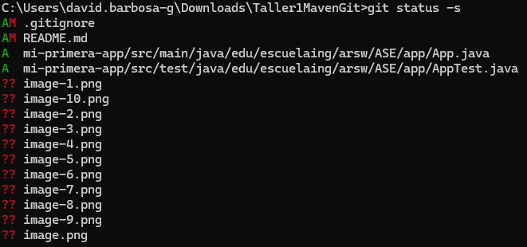

# Introducción a Maven, GIT, GitHub

# Maven

* Instalando Maven

Verificacion de programas instalados 

# Creando un proyecto

* Estructura de archivos

* Código fuente de App.java

* El pom.xml

* Ejecucion

# Git

* Verificacion de programas instalados 

* Configure su identidad y su editor por defecto

* Crear un repositorio GIT

* Use el comando "add"

* Confirmar los cambios en GIT y crear una nueva versión (commit)

# Trabajando con repositorios remotos (remotes)

* Verificaciones de la creacion del repositorio remoto

* Agregar más archivos a su proyecto de Git y su repositorio remoto

* Ignorando algunos archivos

* commit

* push

* Obtener una copia de un repositorio remoto

